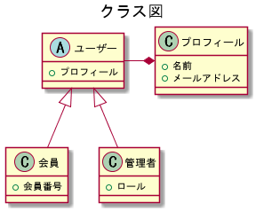

# plantuml

## vscode用プラグイン

使用してみたら使い勝手が良かったので紹介します。

※普段はvscode使ってません。

インストール等は以下参照

[Qiita PlantUMLの環境を設定する（シンタックスハイライト+リアルタイムプレビュー）](https://qiita.com/koara-local/items/e7a7a7d68a4f99a91ab1)

## よく使うコマンド

|ショートカット |説明                                                                                                                              |
|---------------|----------------------------------------------------------------------------------------------------------------------------------|
|Alt + D        |プレビュー                                                                                                                        |
|Ctl + Shift + P|カーソル位置のダイアグラムをエクスポート<br>カーソル位置のダイアグラムをURLへ変更<br>ワークスペース内のダイアグラムをエクスポート |

## デモ

以下のサンプルを使って少しデモ

### plantumlのサンプル

細かい仕様は、[公式ページ](http://plantuml.com/)を参照

#### ユースケース図


<iframe src="https://gist.github.com/kgfnk/c8e594d849b4ac90c1fbb3a6e8736c61.pibb" width="100%" height="400" allowtransparency="true" frameborder="0"></iframe>

---

#### シーケンス図


<iframe src="https://gist.github.com/kgfnk/f277dae2f447a6dd8a9b882cc873db36.pibb" width="100%" height="400" allowtransparency="true" frameborder="0"></iframe>

---

#### 状態遷移図


<iframe src="https://gist.github.com/kgfnk/629c7a60d8fb67e797d1a4ba3722e14a.pibb" width="100%" height="400" allowtransparency="true" frameborder="0"></iframe>

---

#### アクティビティ図


<iframe src="https://gist.github.com/kgfnk/046cb535d7a05c32ada1bd8aed090d07.pibb" width="100%" height="400" allowtransparency="true" frameborder="0"></iframe>

他サイトからの丸コピ

[フローチャート](http://plantuml.com/activity-diagram-beta#sdl)にも使えそう

---

#### クラス図



<iframe src="https://gist.github.com/kgfnk/2238aef72ea75d31723c22c046311af8.pibb" width="100%" height="400" allowtransparency="true" frameborder="0"></iframe>

---

#### ER図


<iframe src="https://gist.github.com/kgfnk/a3f073e46d41d33822cb9bcdf587bdb1.pibb" width="100%" height="400" allowtransparency="true" frameborder="0"></iframe>

---

### おまけ

#### ガントチャート


複雑な事をするのは難しいかも

<iframe src="https://gist.github.com/kgfnk/badf79db88367ea4b3ec5d05150cb9b8.pibb" width="100%" height="400" allowtransparency="true" frameborder="0"></iframe>

---

#### 画面設計


シンプルな画面イメージになら使える？

<iframe src="https://gist.github.com/kgfnk/10d1a199e6668da822c4f09c3e9602ae.pibb" width="100%" height="400" allowtransparency="true" frameborder="0"></iframe>

### markdownに埋め込む

#### 直接埋め込む

直接以下のテキストを書くだけ

<iframe src="https://gist.github.com/kgfnk/81666b05957ef16cb6642c2145661ff7.pibb" width="100%" height="200" allowtransparency="true" frameborder="0"></iframe>

#### URLを埋め込む

カーソル位置のダイアグラムをURLへ変更

自動でmarkdown用リンクが作成される

```markdown

```

##### PlantUML ServerにGitHub Gistに登録したテキストを渡す方法(追記)

```markdown

```

#### 画像を作成して埋め込む

ワークスペース内のダイアグラムをエクスポート

`/out/`ディレクトリに画像を作成してくれる

```
out
　├─1_usecase
　│　　　ユースケース図.png
　│
　└─2_sequence
　　　　シーケンス図.png
```

## 似た仕組み

- [mermaidjs](https://mermaidjs.github.io)
- [Graphviz](http://graphviz.readthedocs.io/en/stable/index.html)
- [blockdiag](http://blockdiag.com/ja/index.html)

## 参考サイト

- [Visual Studio Code](https://code.visualstudio.com)
- [PlantUML](http://plantuml.com)
- [PlantUML Server](http://www.plantuml.com/plantuml/)
- [Qiita PlantUMLの環境を設定する（シンタックスハイライト+リアルタイムプレビュー）](https://qiita.com/koara-local/items/e7a7a7d68a4f99a91ab1)
